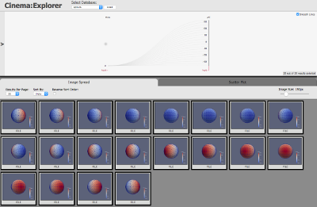
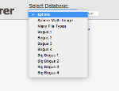
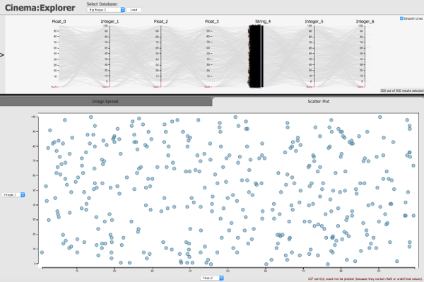

Cinema:Explorer test plan for a cinema export
----------------------------------------------

Pull Cinema:Explorer from  https://github.com/cinemascience/cinema_explorer

Cinema:Explorer comes with a set of example data bases which can be used to test this release.

Use **Firefox** as the browser.  

## Installation
To install Cinema:Explorer, copy the **cinema.html** and **cinema/**
directory to the same directory as your data. In a simple example, the installed files might look like this:

```

  cinema.html
  cinema/
  database_01.cdb
  database_02.cdb
  database_03.cdb

```

## Control file: databases.json

The databases.json file controls which databases are loaded into Cinema:Explorer.  It can be found in:

```

path/to/cinema_explorer/cinema/explorer/1.9/databases.json

```
Edit to add your databases.  The examples will be used below.

## Testing with example databases
- Open cinema_explorer.html in Firefox.  Cinema:Explorer will open with the first database in the list: **sphere.cdb**.  You should see: 

- Choose from the dropdown menu to load a different database: 

- Check NaN, missing files, **axis_order.csv**:  Choose **Bogus 1** and click **Load**.  Bogus 1 includes an **axis_order.csv** file. It also contains NaN values and missing files.

- Check multi-image: Choose **Sphere Multi-Image**.  Each row in the CSV file has two images.  Click on a left and a right image to bring up in modal view.  Return by clicking on background again.  

- Check switch to Canvas mode for large databases: Choose **Big Bogus 2** and you will get a warning:  

- Check Scatter Plot mode: Load a database while the Scatter Plot tab is selected (as opposed to the default Image Spread):


- Check the **query panel**: 

- Load a database while the query panel is open.

- Load a database while the smoothLines checkbox is unchecked.

- Make a query with both the SVG and Canvas versions of the pcoord component.

- Make a selection using the parallel coordinates axes by left-click and hold to select a region along an axis: 

### Other checks:

- Select and highlight data with both the SVG and Canvas versions of the pcoord and scatterPlot components.

- Toggle "Smooth Lines" on and off with both the SVG and Canvas versions of the pcoord component.

- Change the selection while not on the first page of results in the image spread.

- Exercise the image spread options and ensure that sorting, pagination, reverse sort and resizing behave as expected.  

- Choose a database that is not to specification and confirm an error.  
